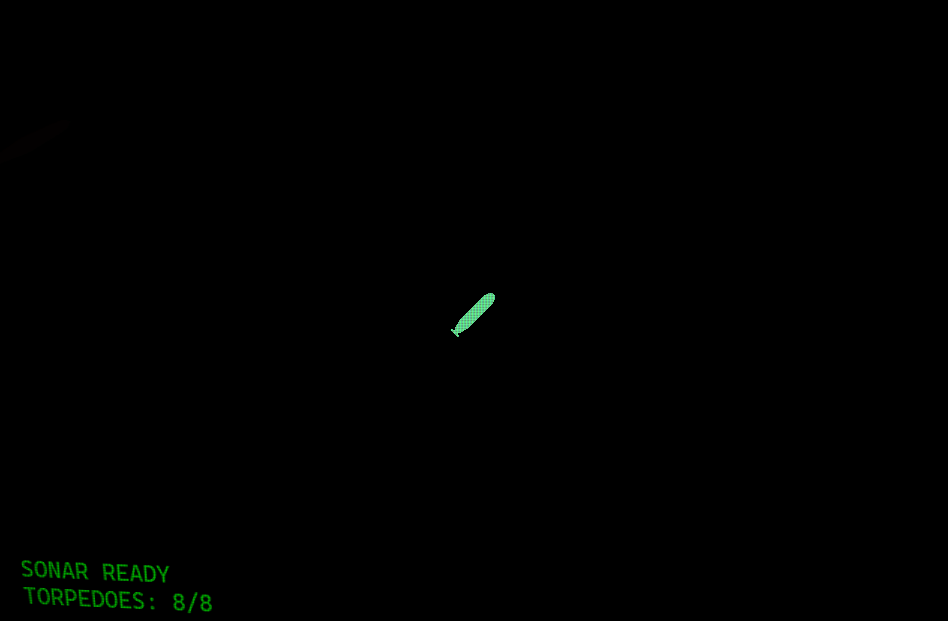
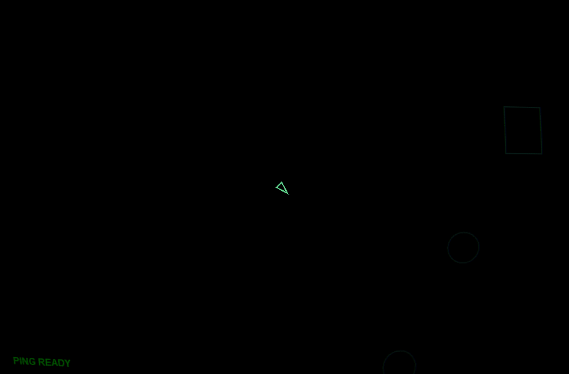
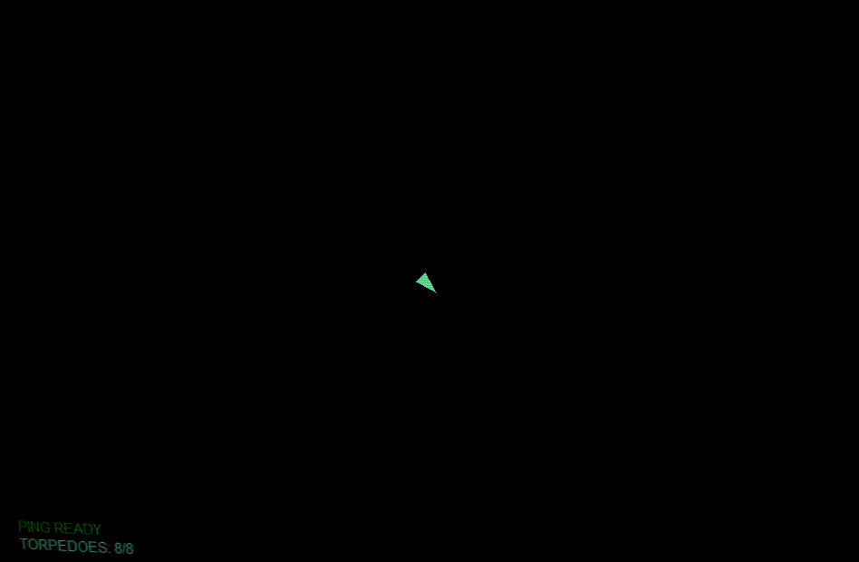

# The Hunt for Red April

A sonar-based submarine stealth game made for [Ludum Dare 59](https://ldjam.com/).

The theme of LD59 is **Signal**.

## Premise

You command a lone submarine hunting an aircraft carrier escorted by a fleet of destroyers. The ocean is pitch black. Your only tool for seeing the world is sonar, but every ping you send reveals your position to the enemy.

The game started as a sub-vs-sub duel prototype and pivoted to a submarine-vs-surface-fleet design during the jam.

## How to play

- **WASD**/**Arrow keys** to steer and throttle the submarine
- **Space** to emit a sonar ping (reveals terrain, ships, and depth charges, but alerts nearby destroyers)
- **Shift**/**Ctrl** to fire a torpedo

**Win** by torpedoing the carrier (two hits). **Lose** by getting caught in a depth charge blast, colliding with terrain, or running out of torpedoes.

Destroyers patrol the map and escort the carrier. When they detect you (via their own sonar or your ping), they chase your predicted position and drop depth charges. Torpedoes can also destroy destroyers to thin the escort.

## Background

I initially planned on developing a submarine vs submarine type of a duel game (titled "The Long Ping"), but after finishing the first prototype, I figured it'd be too much work to get the pathfinding and dueling gameplay to work smoothly and feel engaging, so I pivoted to a bit more asymmetric approach.

With ships, they don't need to path around the underwater terrain and I felt that their AI can be significantly simpler as they can just swarm the player's submarine. With that, the game became "The Hunt for Red April", which is an odd choice given that the game is no longer about hunting a sub, but sometimes I miss the mark with my game jam games' names.

## Tools

- Game engine: [Solar2D](https://solar2d.com/)
- Map: [Tiled](https://www.mapeditor.org/)
- Images: [Photopea](https://www.photopea.com/)
- Audio editing: [Audacity](https://www.audacityteam.org/)
  - Note: the original sound effects are from Pixabay.

## License

MIT License. Copyright 2026 Eetu Rantanen.
